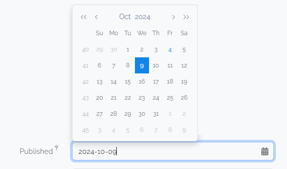
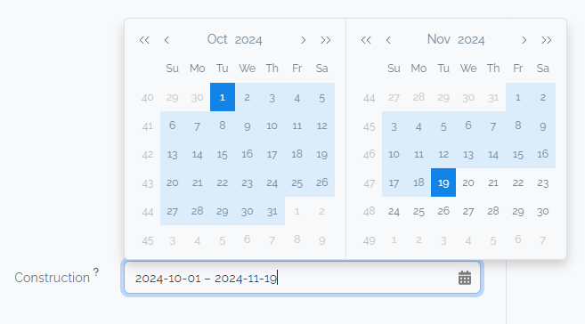
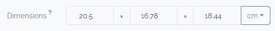

# Attribute Types

The Spacialist provides a big variety of different attribute types that can be used inside your [Data Model](/user/data-model).
Named versions of those *Attribute Types* are used to populate the [Entity Types](./entity-type).

In the next section we'll introduce all available attribute types, what they are used for and how the import data has to be formatted.

## Boolean

Used for single checkbox to represent the binary values `true`and `false`.

### Import Format

When importing only truthy values will be considered. When cells are empty those are considered as `false`.

The values that are considered true are:

- `x`
- `t` or `true`
- `w` or `wahr` 
- [numeric values](https://www.php.net/manual/de/function.is-numeric.php) > 0

## Date

Represents a single date attribute, that is rendered with a default calender input field in the application.

### Import Format

`YYYY-MM-DD` e.g. `2024-10-30`

It only accepts dates in the format 

## Date Range

Represents a date range between two dates.

### Import Format

`YYYY-MM-DD;YYYY-MM-DD` e.g. `2024-10-25;2024-10-30`

The range must have a `START` and `END` date with the format `YYY-MM-DD`separated by a semicolon. The start date **must** be earlier than the end date:
`START;END`

## Dimension

This attribute represents the extends of a three-dimensional object, with width, height, depth and an arbitraray unit (_Note: that this is not powered by the SI-Unit system_).

### Import Format

`W;H;D;UNIT` e.g `2.5;51.2;210.3;cm`

The values `W`,`H` and `D` must be numeric values. And the `UNIT` value may be any string. Those values need to be separated by a semicolon `;`.

## Double (Floating Point Number)

Represents a floating point number.

### Import Format

`N`

Must be any valid floating point number representation using a `.` as a decimal separator. `234`, `-18`, `2.3`, `1.2e3` or `7E-10`.

## Dropdown Multiple

A dropdown that allows selelcting from a list of concepts from the thesaurus.

### Import Format

`CONCEPT_1;CONCEPT_2;CONCEPT_3;[...]` e.g. `Red;Green;Blue`

A list of concepts that is separated with a semicolon `;`. For more infos see `Dropdown Single`

## Dropdown Single

A dropdown that is populated by thesaurus concepts and allows the selection of exactly one item. 

### Import Format

`CONCEPT_NAME` e.g. `Red`

The concept name must match excactly the concept that you want to import. The concept can be in any language.

## Entity

A dropdown for selecting a single entity. Can be limited to a specific entity type. 

## Import Format

`ENTITY_NAME`

The entity name must match the entity (case-sensitive).

## Entity Multiple

A dropdown for selecting multiple entites. Can be limited to a specific type.

### Import Format

`ENTITY_1;ENTITY_2`

The entities to import. Must match the entity name (case-sensitive).

## Epoch

Has two parts. A time span field and a thesaurus dropdown field to specify the epoch.

## Import Format

`START;END;EPOCH_CONCEPT` e.g. `-100;30;antiquity`

A start year and a end year in the gregorian calendar as integer values. Optional can be an epoch thesaurus concept. If the year is a negative number, it refers to the time before christ.