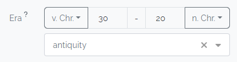

# Attribute Types

The Spacialist provides a big variety of different attribute types that can be used inside your [Data Model](/user/data-model).
Named versions of those _Attribute Types_ are used to populate the [Entity Types](./entity-type). There are additional [_System Attributes_](./attribute.md#system-attributes) which don't need to be created but can be used right away.

| Boolean (yes / no) | Date                                            | Number                                 | Sets                                                  | Reference               | Lists         | Text                    | Geography             |
|-----------------------|-------------------------------------------------|----------------------------------------|-------------------------------------------------------|-------------------------|---------------|-------------------------|-----------------------|
| [Checkbox](#checkbox) | [Date](#date)                                   | [Si-Unit](#si-unit)                    | [Entity](#entity)                                     | [URL](#url)             | [List](#list) | [Textbox](#textbox)     | [WKT](#wkt-geography) |
|                       | [DateRange](#date-range)                        | [Percentage](#percentage)              | [Entity (Multiple Choice)](#entity-multiple-choice)   | [Iconclass](#iconclass) | Table         | [Textfield](#textfield) |                       |
|                       | [Time Period](#time-period)                     | [Float](#numeric-input-floating-point) | [Single Choice Dropdown](#single-choice-dropdown)     | [RISM](#rism)           |               | [Rich-Text](#richtext)  |                       |
|                       | [Time Period And Epoch](#time-period-and-epoch) | [Int](#numeric-input-integer)          | [Multiple Choice Dropdown](#multiple-choice-dropdown) |                         |               |                         |                       |
|                       |                                                 | [Dimension](#dimension)                |                                                       |                         |               |                         |                       |

In the next section we'll introduce all available attribute types, what they are used for and how the import data has to be formatted. Note the following special symbols that may be used in the formatting, which will not be typed and have only semantic meaning.

+ ... - is a placeholder for various content
+ \[...\] - Stand for optional syntax, the squared brackets should be ignored
+ [... ⟳] - Stands for an expression that can be repeated indefinetly

## Checkbox

Used for single checkbox to represent the binary values `true`and `false`.

### Import Format

When importing only truthy values will be considered. When cells are empty those are considered as `false`.

The values that are considered true are:

- `x`
- `t` or `true`
- `w` or `wahr` 
- [numeric values](https://www.php.net/manual/de/function.is-numeric.php) > 0

## Date

Represents a single date attribute, that is rendered with a default calender input field in the application.

### Import Format

`YYYY-MM-DD` e.g. `2024-10-30`

It only accepts dates in the format 

## Date Range

Represents a date range between two dates.

### Import Format

`YYYY-MM-DD;YYYY-MM-DD` e.g. `2024-10-25;2024-10-30`

The range must have a `START` and `END` date with the format `YYY-MM-DD`separated by a semicolon. The start date **must** be earlier than the end date:
`START;END`

## Dimension

This attribute represents the extends of a three-dimensional object, with width, height, depth and an arbitraray unit (_Note: that this is not powered by the SI-Unit system_).

### Import Format

`W;H;D;UNIT` e.g `2.5;51.2;210.3;cm`

The values `W`,`H` and `D` must be numeric values. And the `UNIT` value may be any string. Those values need to be separated by a semicolon `;`.

## Entity

A dropdown for selecting a single entity. Can be limited to a specific entity type. 

### Import Format

`ENTITY_NAME`

The entity name must match the entity (case-sensitive).

## Entity (Multiple Choice)

A dropdown for selecting multiple entites. Can be limited to a specific type.

### Import Format

`ENTITY_1;ENTITY_2`

The entities to import. Must match the entity name (case-sensitive).

### Import Format

`START;END;EPOCH_CONCEPT` e.g. `-100;30;antiquity`

A start year and a end year in the gregorian calendar as integer values. Optional can be an epoch thesaurus concept. If the year is a negative number, it refers to the time before christ.

## Iconclass

Can be used to collect data as Iconclass objects, as specified at [https://iconclass.org/](https://iconclass.org/).

### Import Format

`ICONCLASS_STRING` e.g. `22A311`

Any iconclass string as defined at [https://iconclass.org/](https://iconclass.org/).

## List

Field for a list of text values.

### Import Format

`TEXT[;TEXT ⟳]`

An arbitrary number of items separated by a semicolon.

## Multiple Choice Dropdown

A dropdown that allows selelcting from a list of concepts from the thesaurus.

### Import Format

`CONCEPT_1;CONCEPT_2;CONCEPT_3;[...]` e.g. `Red;Green;Blue`

A list of concepts that is separated with a semicolon `;`. For more infos see `Dropdown Single`

## Numeric Input (Floating Point)

Represents a floating point number.

### Import Format

`N`

Must be any valid floating point number representation using a `.` as a decimal separator. `234`, `-18`, `2.3`, `1.2e3` or `7E-10`.

## Numeric Input (Integer)

Field for integer values

### Import Format

`INT_VAL` e.g. `5`

Can be any integer number `x` that is in the valid range of [PHP_INT_MIN](https://www.php.net/manual/en/reserved.constants.php#constant.php-int-min)  < x <[PHP_INT_MAX](https://www.php.net/manual/en/reserved.constants.php#constant.php-int-max).

## Percentage

Field that allows 

### Import Format

`X` e.g. `33`

`X` is an integer value in the form of: 0 <= `X` <= 100.

## Richtext

This creates a textarea with formatted text, allowing various text decorations
that are specified in the very simple [Markdown Syntax](https://www.markdownguide.org/cheat-sheet/).

Spacialist offers a convenient editor to edit these text with tools most know from Softwares like
Word.

The unformatted Markdown text looks like this.

### Import Format

`X` e.g. 

> \# Heading
> 
> Some Text with \*\*bold\*\* or \_italic\_ or  \~struck out~\

`X` is a text string that may contain markdown syntax.

## RISM

Id to a musical peace inside the [RISM catalog](https://rism.info/).

### Import Format

`X` e.g. `600146721`

`X` needs to be a positive integer value.

## Serial

The serial attribute counts all entities that have this attribute attached and displays a distinct index number for every one of them.
To use the counter you must use the `%d`marker during the creation of this attribute. This allows to create meaningful tags e.g. `find_#%d` which results in `find_#5`.
The order of the enumeration is the time the entity was created. To ensure always `n`glyphs in the counter (e.g. #003) you may use the syntax `%03d`.

::: warning
This serial is not a persistent id, as it may change. When some entities are created at the same time or an entity type receives or loses this attribute, the enumeration will change!
::: 

### Import Format

::: danger
Serial values cannot be imported
:::

## Si Unit

A numeric input associated with a si unit. The si type (e.g. mass or temperature) is fixed when creating the attribute. The si 'prefix' (e.g. kg, g, t) can be changed by the user.

### Import Format

`VALUE;UNIT` e.g. `80;kg`

`VALUE` must be a numeric value. `UNIT` must be a supported unit.

## Single Choice Dropdown

A dropdown that is populated by thesaurus concepts and allows the selection of exactly one item. 

### Import Format

`CONCEPT_NAME` e.g. `Red`

The concept name must match excactly the concept that you want to import. The concept can be in any language.

## Textbox

A textbox for short, unformatted texts.

### Import Format

`X` e.g. `This is a note`

`X` is any string.

## Textfield

A textarea for longer, unformatted texts.

### Import Format

`X` e.g. `This is a note`

`X` is any string.

## Time Period

A span of two years (as integers).

### Import Format

`START;END` e.g. `-100;30`

A start year and a end year in the gregorian calendar as integer values. If the year is a negative number, it refers to the time before christ. The start year must be before the end year.

## Time Period and Epoch

Has two parts. A time span field and a thesaurus dropdown field to specify the epoch.

## URL

A textfield that contains a link. The field can be clicked to visit that website in a new tab.

### Import Format

`X` e.g. `https://uni-tuebingen.de`

`X` is any string.

## UserList

A list of users.

### Import Format

`USER_1;USER_2` e.g. `john;admin`

`USER` must be an existing nickname of a user.

## WKT (Geography)

Adds a geographical attribute to the entity. Currently they cannot be linked on the main map. Each entity has a single field for geo referencing internally.

### Import Format

`WKT_STRING` e.g. `POINT(1 1)`

Any valid WKT string, a good overview of these strings can be found on [Wikipedia](https://en.wikipedia.org/wiki/Well-known_text_representation_of_geometry).
