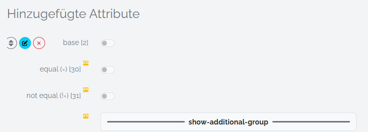

# Attribute

An attribute is a certain implementation of an Attribute in combination with a [Dictionary Label](./thesaurus). These attributes are applied to [_Entity Types_](./entity-type.md) to create Spacialists [_Data Model_](./data-model.md).

## System Attributes

Some attributes may be provided by spacialist by default. Currently (v.0.11) there is only the Group Separator

### Group Separator

Creates a subsection on an [_Entity Type_](./entity-type.md) to bundle the following attributes (up to the next _Group Separator_ or the end) insisde a separate tab in the _Entity View_.

## Dependencies

_Attribute Dependencies_ are a feature to conditionally hide attributes. 
When adding an attribute to an [_Entity Type_](./entity-type.md) you can specify a variety of conditions on when those attributes should be shown. 

To add a dependency you hover over the _Attribute_ you attached to the _Entity Type_. And press the _edit_ button. The yellow icon marks attributes that habe an dependency defined.

In the edit dialog, you see this view, where you can add new rules to the dependency. And you can set if either one of the rules must match (Or) or of all rules must match (And). Furthermore you have the ability to add multiple groups (+) to create more complex rules.

You can use varios operators, to accomplish the effect you desire. All available operators are listed below.
Further down, you can find which operators apply for the different _Attribute Types_.

| Condition     | Effect                                                                           | Symbol  | Technical    |
| ---           | ---                                                                              | ---     |---           |
| set           | The attribute does contain a value, therefore is **not** empty                   | ?       | x != null    |
| unset         | The attribute does **not** contain a value, therefore is empty                   | ?!      | x == null    |
| equal         | The attribute equals the selected value _y_                                      | =       | x == y       |
| not equal     | The attribute is **not** equal the selected value _y_                            | !=      | x != y       |
| less          | The attribute is less than the selected value _y_                                | <       | x < y        |
| less equal    | The attribute is less or equal the selected value _y_                            | <=      | x <= y       |
| greater       | The attribute is greater than the selected value _y_                             | >       | x > y        |
| greater equal | The attribute is greater or equal the selected value _y_                         | >=      | x >= y       |

Furthermore, you can define multiple _Dependency Groups[1]_, to cover more complex cases.
Inside the group you have one operand and over the other groups you have it's counterpart (e.g. in the groups _AND_ and inbetween groups _OR_). If a system separator is hidden, it's whole tab will not show up.

**Available Dependency Types For Each Entity Type**

| Attribute Type        | Supporter Rules                                                         |
| ---                   | ---                                                                     |
| boolean               | =, !=                                                                   |
| date                  | =, !=, **?, !?,** <, <=, >, >=                                          |
| daterange             | -                                                                       |
| dimension             | -                                                                       |
| double                | =, !=, <, <=, >, >=                                                     |
| entity                | =, !=                                                                   |
| entity-mc             | =, !=                                                                   |
| geography             | -                                                                       |
| iconclass             | =, !=, ?, !?                                                            |
| integer               | =, !=, <, <=, >, >=                                                     |
| list                  | =, !=, ?, !?                                                            |
| percentage            | =, !=, <, <=, >, >=                                                     |
| richtext              | ?, !?                                                                   |
| rism                  | =, !=, ?, !?                                                            |
| serial                | -                                                                       |
| si-unit               | =, !=, <, <=, >, >=                                                     |
| sql                   | -                                                                       |
| string-sc             | =, !=, ?, !?                                                            |
| string-mc             | =, !=, ?, !?                                                            |
| table                 | -                                                                       |
| textbox               | =, !=, ?, !?                                                            |
| textfield             | =, !=, ?, !?                                                            |
| timeperiod            | -                                                                       |
| timeperiod and epoch  | -                                                                       |
| url                   | =, !=, ?, !?                                                            |
| userlist              | -                                                                       |
|**System Attributes** ||
|system-separator | - |

[1] **First Released in 0.11**