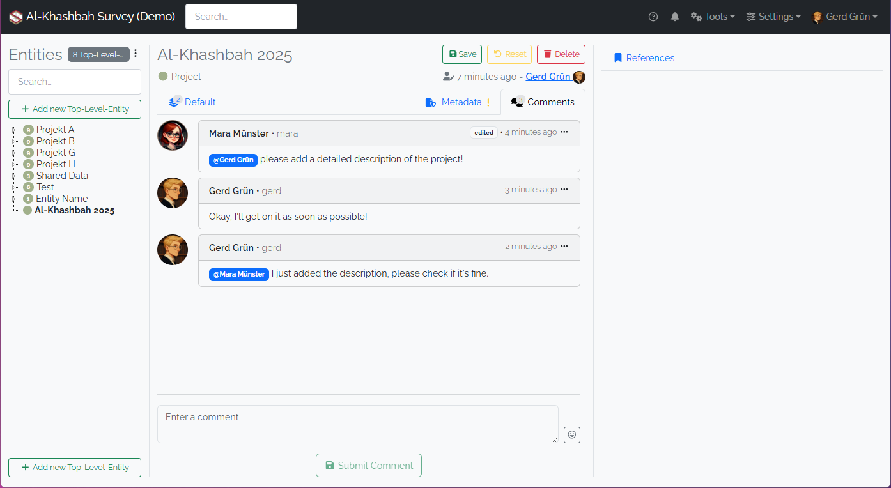
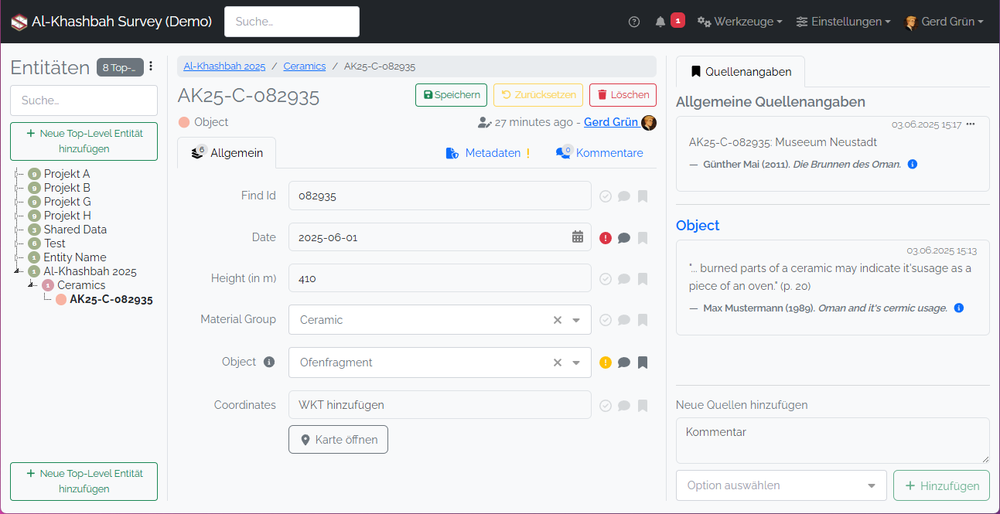
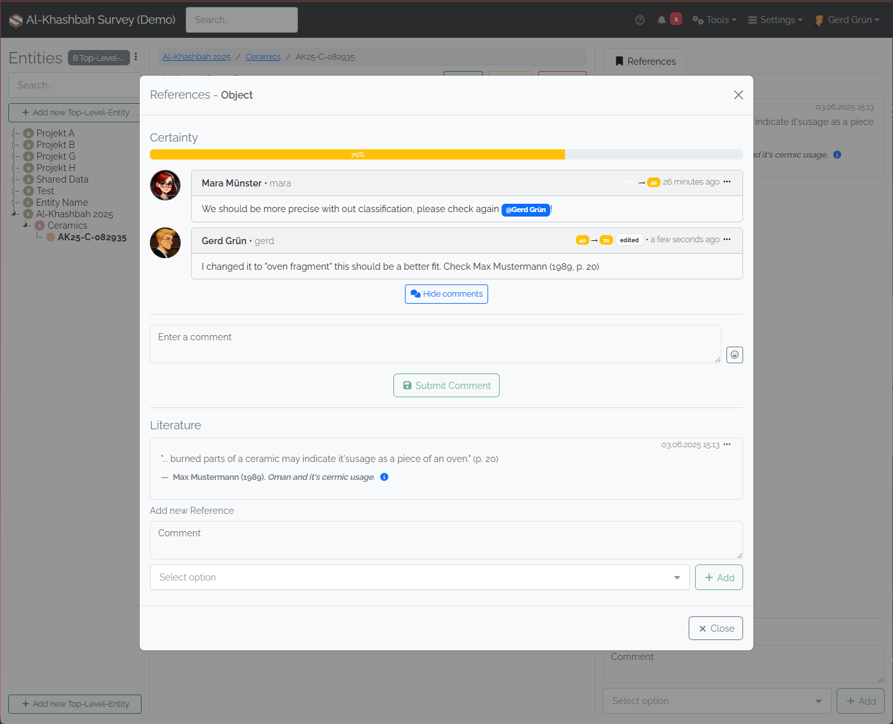
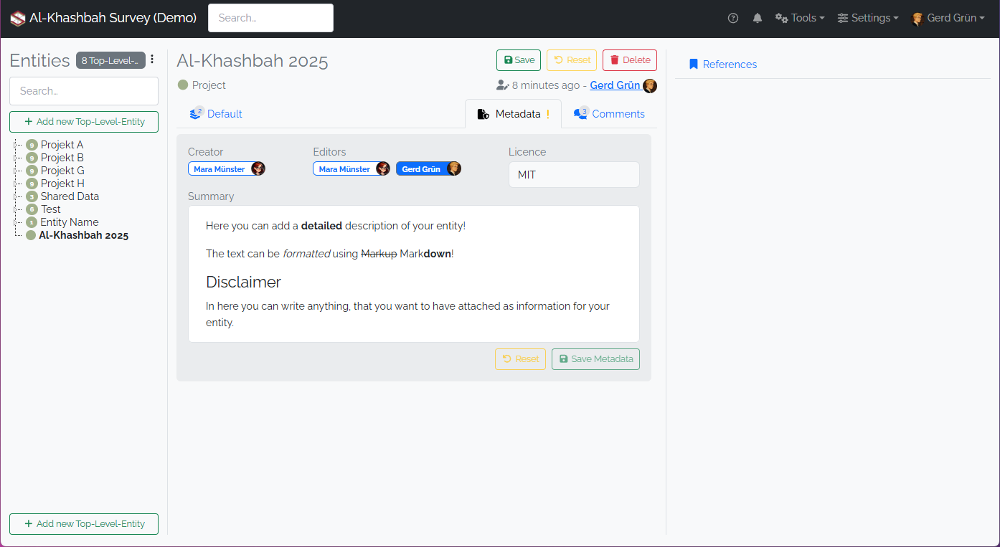

# Collaboration

There are a growing number of features that allow the users to work collaboratively inside the _Spacialist_ software.

## Comments

User have the ability to leave comments on every entity and can discuss ideas or problems directly on the data itself.

## Bibliography

Users can reference Bibliography from the managed [_Bibliography_](./bibliography.md) directly on every entity[1].

[1]  First released in version 0.11

## Attribute Comments, Bibliography & Certainty 

Attributes are the most molecular data inside the _Spacialist_ software. The users can set attributes "Uncertain" when the data source is not reliable and needs discussion and/or further research. This uncertainty can be discussed by using comments and/or bibliography references directly at the respective attribute. If an attribute is marked as uncertain (!), has comments (💬) or has a bibliography reference (🔖) attached can be seen directly in the entity overview (A). Clicking on any of the symbols opens the window (B) where you can change the certainty, while optionally leaving a comment or add a quotation to the attribute, which is then seen inside the References Tab (see A).

(A) 

(B)

## Metadata

You can add additional metadata to every entity, using the metadata tab. Here you can add a license, and a description of the entity.
Currently the creators and the editors are shown in the tab [2], in the future there should be the option to add furthor 'authors' 
to the entities, that did not actively work on said entity.

[2] Introduced in version 0.11