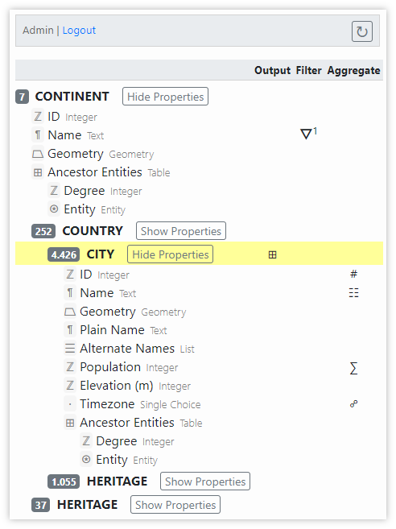

# Data Analysis Tool: Database Structure Pane

This pane contains two parts: a header and a tree representing the nested structure of entities in the database.

## Header

The header displays the name of the logged in user and a link to log out of the tool. The header also contains a button labeled with the symbol `↻`. It can be used to [refresh the database](data-analysis#refreshing-the-database). To the left of this button there is an indication of the date/time when the database was last refreshed. This space may temporarily display some relevant status text when working with the tool, particularly when lengthy processing is taking place.

## Tree

The main portion of the pane is occupied by a tree-like display of the structure of entities in the database. The nesting of entity types in the tree reflects the actual nesting of entities in the database. 

> **Example**: in the screenshot, we see that there are 7 entities of type _Continent_ in the database at top level. As child entities of these top-level _Continent_, there are 252 _Country_ and 37 _Heritage_ entities. The _Country_ entities have a total of 4,426 _City_ child entities and 1,055 _Heritage_ child entities.

By clicking the `Show Properties` button next to the entity type labels, the list of properties of the entity type fades in. Each property is listed with its label (i.e. _ID_, _Name_, _Geometry_, etc. in the screenshot), its data type (e.g. _Integer_, _Text_, _Geometry_, etc.), and an icon symbol that represents its data type as follows:

* Boolean: `◧`
* Date: `▣`
* Date Range: `⇿`
* Dimension: `⛶`
* Double: `ℝ`
* Entity: `⍟`
* Entity List: `☰`
* Epoch: `⥈`
* Geometry: `⏢`
* Iconclass: `🖺`
* Integer: `ℤ`
* List: `☰`
* Percentage: `%`
* Rich Text: `¶`
* RISM Entry: `🗄`
* Serial ID: `⚿`
* SI Unit: `Ω`
* String: `¶`
* Multiple Choice: `⋮`
* Single Choice: `·`
* Text (multiline): `¶`
* Table: `⊞`
* Timespan: `↦`
* URL: `⟴`
* User List: `☰`

Some entity types may expose nested properties. These table properties (e.g. _Ancestor Entities_ in the screenshot) have child properties, each reflecting a column of the table property.

The three columns _Output_, _Filter_, and _Aggregate_, display symbols for any row that is used in the [Analysis Options](data-analysis-options-pane), respectively.

> **Example**: in the screenshot above, the analysis options specify to output a table (`⊞`) of _City_ entities. There is one filter (`Ұ`) on the property _Name_ of ancestor _Continent_ entities. The result table of cities is grouped (`☍`) by values of property _Timezone_. The result table also includes a count of _City_ entities (`#`), a list of entity _Names_ (`☰`), and the sum of _Population_ (`∑`) as aggregate properties.

The row in the tree above which the user hovers the mouse pointer is highlighted with yellow background.