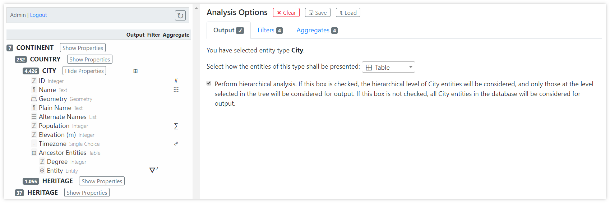
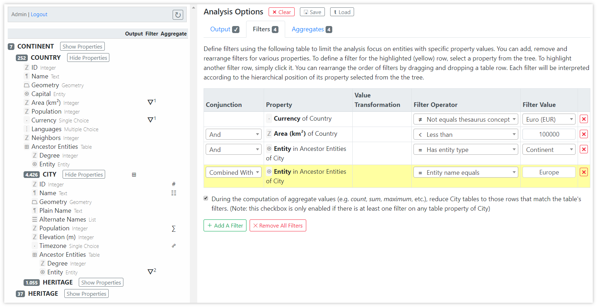
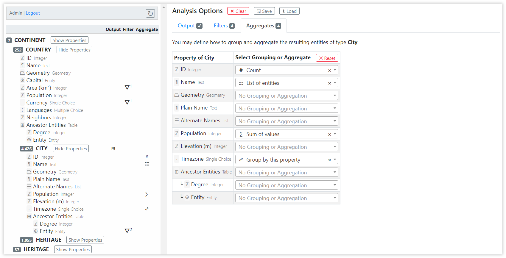

# Data Analysis Tool: Analysis Options Pane

This pane is used for defining all analysis options. The options are separated into three different tabs: _Output_, _Filters_, and _Aggregates_.

In addition, there are three buttons next to the heading: One button to clear the analysis, which basically resets all analysis options, and two buttons to [save an analysis and to load a saved analysis](data-analysis#saving-and-loading-an-analysis).

## Output Tab

When the output tab is activated, you may choose the main analysis object by clicking an entity type or property in the tree in the [Database Structure Pane](data-analysis-database-structure-pane). 

> **Example**: In the screenshot, the user has selected entity type _City_ as the analysis object. The resulting entities will be displayed in a table. The user has opted to perform a hierarchical analysis, which means that only those _City_ entities, which are in a _Continent_/_Country_ hierarchy from the root, will be processed during analysis, and all other entities will be ignored. Note that since the [Database Structure Pane](data-analysis-database-structure-pane) shows that there are no other nesting levels where _Country_ entities occur in the database, in this particular case the checkbox will have no effect on the result. Had the user selected _Heritage_ for output, the checkbox would make a difference, because there are 1,055 _Heritage_ entities under _Continent_/_Country_, and an additional 37 directly under a top-level _Continent_.

[→ Read more about picking an output object](data-analysis#picking-an-output-object)

## Filters Tab

The filter tab shows a table, in which each row represents a filter that is applied to each entity when the analysis is run. Only those entities that match the defined filters, will be considered in the analysis.

The table of filters exposes five columns:
1. _Conjunction_: If more than one filter is defined, each row except the first one will show a dropdown that defines how the filters are logically combined. The following options are possible:
   * `And`: An entity passes the filters only if the current filter **and** the combined filters above the current filter apply
   * `Or`: An entity passes the filters if the current filter **or** the combined filters above the current filter apply
   * `Combined With`: This option is only available if both the current filter and the filter above the current filter operate on a property of the same table property. Only entities where any row of the table property satisfies all adjacent `Combined With` filters on its child properties passes the filtering.
 
2. _Property_: This column displays information about the property selected for filtering by clicking in the database tree.

3. _Value Transformation_: Depending on the type of property selected for filtering, this column may show a dropdown box allowing to transform the property value before applying the actual filter. For example, if the property is a geometry, a transformation could determine the area covered by the geometry.

4. _Filter Operator_: Depending on the type of property and the filter transformation selected, this column offers a dropdown box containing filter operators. For instance, numeric properties will offer comparison operators, among others.

5. _Filter Value_: This is the field where you need to specify an actual value to compare the property value against using the filter operator. For some filter operators (e.g. those that merely check for existence of a property value), this column will be empty because no filter value needs to be specified. When the filter operator targets a concept from the thesaurus, the filter value will show a dropdown offering thesaurus concepts to choose from.

If at least one table property of the output object is part of the filters, then the checkbox below the table becomes active. This checkbox defines whether the table properties should be reduced to those rows that match the table property's filters when computing [aggregate values](#aggregates-tab).

> **Example**: In the screenshot, four filters are defined:
> 1. _Currency of Country_: This filter matches for _Country_ entities that do not have Euro as their currency.
> 2. _Area (km²) of Country_: This filter matches for _Country_ entities that cover less than 100,000 square kilometers.
> 3. _Entity in Ancestor Entities of City_: This filter is on a column of the ancestry table, asserting that there is an ancestor continent. 
> 4. _Entity in Ancestor Entities of City_: This is a second filter on the same table property, asserting that the name of the continent is Europe. This filter is _Combined With_ the previous filter, meaning that both filters must match in the same row of the table property.
>
> The checkbox below the table is activated, meaning that before computing [aggregates](#aggregates-tab), the _Ancestor Entities_ table of each _City_ is reduced to those rows that match filters 3 and 4.

[→ Read more about filtering the analysis data](data-analysis#filtering-the-data)

## Aggregates Tab

If tabular result output was selected in the [output tab](#output-tab), the _Aggregates_ tab becomes visible, allowing grouping and aggregation. This is the last step performed during processing of the analysis, after the filters have been applied.

**Grouping** means that a column of the result table is reduced to its unique values. Grouping can be applied to multiple columns, whereas the result table is then reduced to unique combinations of all grouped properties.

**Aggregation** means that all values in a column of the result table are aggregated into one single value by applying an aggregation function. Typical aggregation functions are counting, identifying the minimum value, computing the sum of all values, and so forth, depending on the type of property.

In the resulting grouped/aggregated table, the first columns will contain the grouped properties, followed by the aggregated properties. All other properties, which are neither grouped nor aggregated, will not be shown in the resulting table.

> **Example**: in the screenshot, we have one grouped property and four aggregate properties:
> * The _Timezone_ property was selected for grouping. This means that the first row of the result table will contain all distinct values of this property in entities that match the filters. 
> * As the first aggregate property we see that _ID_ values are aggregated using `# Count` for each group. The _ID_ property, which every entity has by default, is a unique number. This property therefore serves well to perform counting of entities. 
> * The _Name_ property is aggregated by `☰ List of entities`, which means that this column will show a list of buttons that allow the user to inspect all entity details for each group.
> * The _Population_ property is aggregated by calculating a `∑ Sum of values` for each group.

See an example of the resulting table for the settings in the above screenshots in the [Result Pane](data-analysis-result-pane) description.