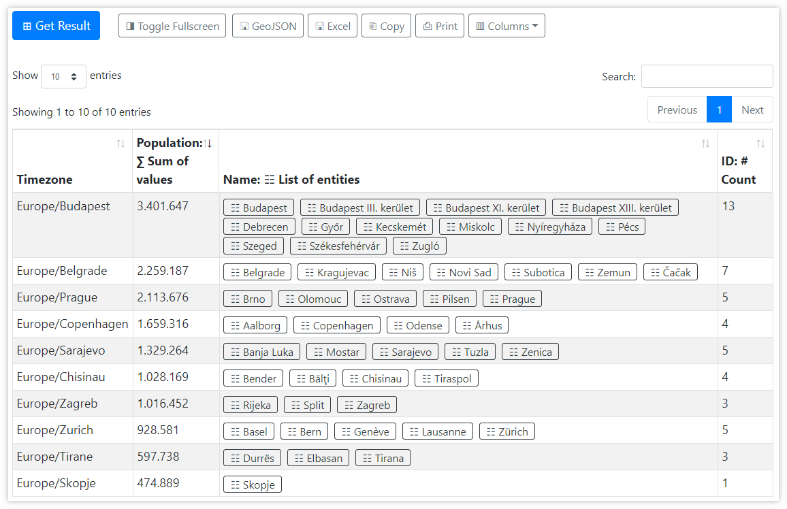
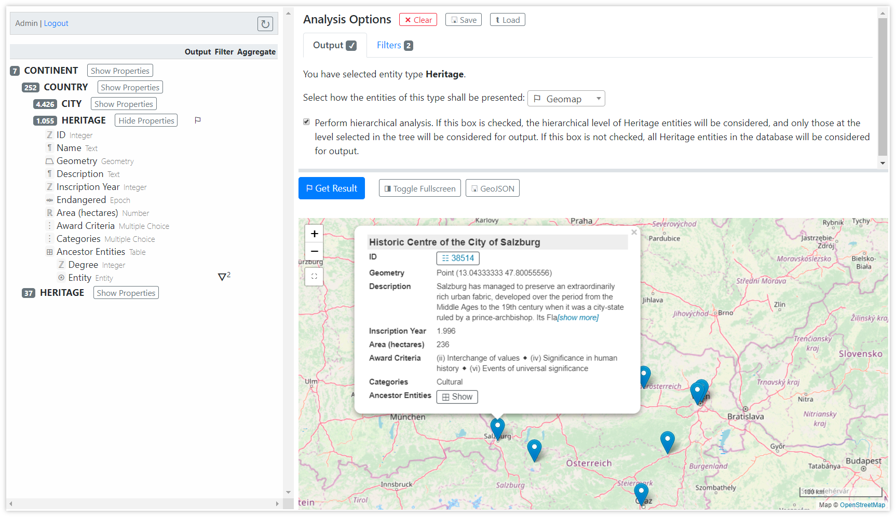
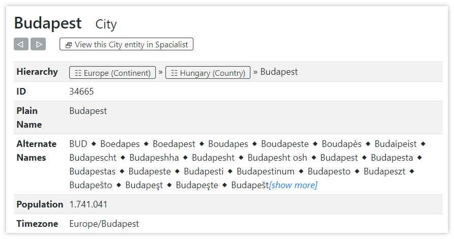

# Data Analysis Tool: Result Pane

The result pane shows the analysis result either as a table, a geomap, or as a single value, depending on the defined analysis options. The user controls are described in more detail in [Working with Analysis Results](data-analysis#working-with-analysis-results). Here we show two examples results.

## Table

Based on the example database and the analysis options shown in the example followed in the [Analysis Options Pane](data-analysis-options-pane), the resulting table looks as follows:

The table was sorted in descending order by the second column, which represents the sum _Population_ of each group. As we see, the highest _Population_ (i.e. density) across cities that match the filters are in the _Europe/Budapest_ timezone.

When clicking, for instance, on the button `⍟ Budapest` in the third column of the first row, the [Entity Details Browser](#entity-details-browser) pops up.

## Geomap

When selecting `⚐ Geomap` as output type for all _Heritage_ entities in the country of Austria, we see a map of Austria. The blue markers visualize the _Geometry_ property of each result entity. When clicking on any marker, a small popup with entity details shows up. The map can be zoomed using the `+` and `-` buttons or the mouse wheel. The map display can be fit to the displayed shapes using the `⛶` button.

## Entity Details Browser

The _Entity Details Browser_ is a popup dialog showing a tabular view of all properties of this entity that contain a value:

On top of the table we see the browsing buttons (`◁` and `▷`), allowing to go back and forth in viewing history, if further entity details have been explored in this browser.

The button `⟴ View this City entity in Spacialist`, when clicked, selects the current entity in the Spacialist main window.

Then first row of the table contains information on the hierarchical nesting of the current entity. We see that this entity is a child entity of `⍟ Hungary (Country)`.