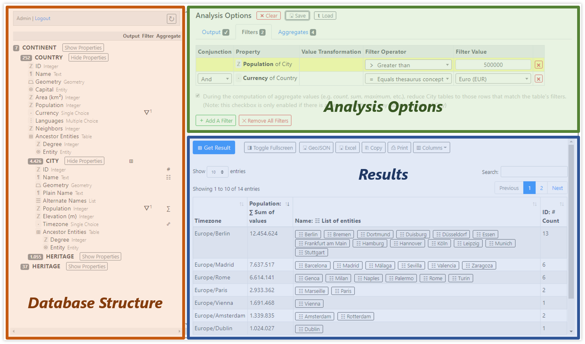

# Data Analysis Tool

The data analysis tool provides a user interface to view, filter and aggregate data inside a Spacialist instance.

## Main Window

The Spacialist Data Analyzer main window as displayed below is organized into three panes:

* **[Database Structure Pane](data-analysis-database-structure-pane)**: this pane on the left (indicated with red coloring in the screenshot below) renders a tree-like, expandable view of the structure of entities in the database. Its header shows the name of the logged in user. The header also includes a button that allows reloading the database.

* **[Analysis Options Pane](data-analysis-options-pane)**: this top-right pane (indicated with green coloring in the screenshot below) includes three tabs, which allow to control what kind of data is being output, what filters are defined on the data, and how properties of the output data are grouped and aggregated. In its header the pane also includes buttons to reset the analysis, and to save and load analyses to and from files, respectively.

* **[Result Pane](data-analysis-result-pane)**: this bottom-right pane (indicated with blue coloring in the screenshot below) shows the analysis result upon clicking the `Get Result` button. The result pane might then show a single value, a table or a geomap, depending on the analysis options.

The contents and symbols in the user interface will become clear after reading the following part on how to run a data analysis.

## Running an Analysis

### Picking an Output Object

The first step when running an analysis, is deciding what kind of information shall be displayed as a result. To do so, make sure the [_Output_ tab](data-analysis-options-pane#output-tab) is selected in the _Analysis Options_ pane. Then click either an entity type (bold all-caps typeface in the tree) or a property of an entity type (after expanding the properties using the `Show Properties` button) from the tree in the _Database Structure_ pane.

**Selecting How Output is Displayed**

* After picking an entity type, the _Output_ tab will show a dropdown with options related to how the entity data shall be displayed in the _Result_ pane. Supported displays are _Table_ (display a table with entities and their properties), _Geomap_ (a map displaying the resulting entities as geometric shapes), and _Count_ (displaying the number of resulting entities)

* After picking a property, the _Output_ tab shows a dropdown with different options of aggregating the value of the property, depending on the type of property. For example, picking a property of type _Number_, the dropdown will offer to show the count, minimum, maximum, sum and mean value of the property, and a distribution of values.

**Hierarchical Analysis**

Additionally, the _Output_ tab includes a checkbox labeled _Perform hierarchical analysis_, which is checked by default. When performing a hierarchical analysis, the hierarchical nesting level of the selected output object in the database structure tree is considered, and only those entities in the database that are at the same hierarchical level as the one selected in the tree will be included in the analysis. If you prefer not to run the analysis hierarchically, then all entities of the selected output object in the database will be included in the analysis regardless of their nesting level.

The selected output object will show a symbol in the _Output_ column of the _Database Structure_ tree to indicate the selection, e.g. `⊞`, when table output was selected.

### Filtering the Data

After picking an output object, the data can be filtered before running the analysis. Filtering means to define conditions that decide whether a specific entity in the database shall be considered for the analysis or not.

> **Example**: when entity type _Fundstelle_ was selected as the output object, you may choose to analyze only those _Fundstelle_ entities that cover an area of at least 5,000 square meters. To achieve this you would define a filter on the _Geometry_ property.

To define a filter, go to the [_Filters_ tab](data-analysis-pptions-pane#filters-tab) in the _Analysis Options_ pane. In this tab, each defined filter covers a row in the table. To highlight a row/filter, click the row in the _Entity Type/Property_ column. Then you click any property in the _Database Structure_ tree. Depending on the type of the selected property, the row will then display dropdown boxes or textboxes in the remaining columns:
* In the _Value Transformation_ column, you can define a value transformation before the filtering is applied. For instance, if a property of type _Geometry_ is selected, the transformation dropdown will offer to filter the _Geometry Type_, the _Area_ covered by the geometry, or its _WKT Representation_.
* In the _Filter Operator_ column, a dropdown offers operators that will compare the property's value to a user-defined filter value. The operators offered depend on the type of property and the value transformation selected. For instance, when selecting _Area_ transformation of a geometric property, the dropdown will offer operators allowing numeric comparisons (e.g., for equality, greater than, less than, and so forth).
* In the _Filter Value_ column you will - for most filters - see a text box, in which you define a specific value that is used to compare the property's value to by using the defined transformation and operator.

All properties with filters defined will show the symbol `Ұ` in the _Filter_ column of the _Database Structure_ tree. The superscript number indicates the number of filters that are defined on the property.

#### Multiple Filters

By adding more filters, you have to select how the filters are logically combined when evaluated against entities in the the database. The dropdown in the first cell of each additional filter row in the filters table usually offers to combine filters using _And_ or _Or_. While running the analysis, the filters are applied one after the other in the order as present in the table.

> **Example**: If there are three filters in the table: `Filter1` _Or_ `Filter2` _And_ `Filter3`. For each entity, the analysis first checks whether `Filter1` matches. If it does, `Filter2` is evaluated. Because of the _Or_ conjunction, those entities where `Filter1` or `Filter2` match, continue to be evaluated. Of the remaining entities, only those where `Filter3` matches (due to the logical _And_ conjunction), are finally considered for the analysis.

#### Filters on Table Properties

In some databases entities may have attributes that do not have an atomic value, but a table of values. These table properties then show child properties in the _Database Structure_ tree, each reflecting a column of the table property.

When defining filters for a table property, an additional logical conjunction is available in the dropdown box, which is called _Combined With_. Such a combination of filters on properties of a table makes sure that only those rows of the table are further considered for the analysis, that match the combined filters.

> **Example**: A table property has three column properties: _Type_, _Count_ and _Notes_. Having filters on _Type_ and _Count_ with the _Combined With_ conjunction means that for each row the analysis engine checks whether both filters match. If not, the row is discarded when computing analysis results.

The checkbox below the filter table defines, if checked, that discarded rows are ignored when computing aggregate values (see the section on Aggregates and Grouping)

#### Filters on Ancestors or Descendants

Filters may not only be defined for the output entity type's properties. Filters may also be defined for properties of entity types that are above or below the output entity type in terms of hierarchical nesting.

> **Example**: Say a database holds _Countries_ as top-level entity types, and as child entity types of countries it stores _Cities_. Now we select _Cities_ as the output object. We can then define a filter on a property of the parent entity type _Country_, e.g. that the country's GDP per capita is lower than $10,000. This way we can get a list of all cities that lie in such countries. 

### Aggregates and Grouping

If tabular result output was selected, the _Analysis Options_ pane shows an additional [_Aggregates_ tab](data-analysis-options-pane#aggregates-tab). In this tab you may optionally define which properties of the resulting table shall be aggregated and/or grouped.

Grouping means that a column of the result table is reduced to its unique values. Grouping can be applied to multiple columns, whereas the result table is then reduced to unique combinations of all grouped properties.

Aggregation means that all values in a column of the result table are aggregated into one single value by applying an aggregation function. Typical aggregation functions are counting, identifying the minimum value, computing the sum of all values, and so forth, depending on the type of property.

By combining grouping and aggregation, the resulting table of entities can be reduced to generate all sorts of statistics.

> **Example**: Say a database holds _Countries_ as top-level entity types, and as child entity types of countries it stores _Cities_. Now we select _Cities_ as the output object. We now group by the city property _Governing Party_ and aggregate the property _Population_ using the _Mean value_ function. This way we get a sortable table showing all distinct governing parties of any city in the first column, and the average population of the citites governed by each party in the second column.

All properties that are grouped will show the symbol `☍` in the _Aggregate_ column of the _Database Structure_ tree. All properties that are aggregated will show a symbol in the same column. The symbol for aggregation reflects the type of aggregation function selected in respective dropdown box in the _Aggregates_ tab (e.g. `∑` for sum).

### Working with Analysis Results

Clicking the `Get Results` button in the _Results_ pane will trigger the analysis and display the results. The _Result_ pane can be toggled to display full screen by clicking the `◨ Toggle Fullscreen` button. For table and geomap result displays, clicking the `⏢ GeoJSON` button will download a GeoJSON file representing the geometric shapes attached to the entities in the result (if any). These GeoJSON files can be imported in various GIS systems like QGIS, ArcGIS, and in frameworks like Leaflet or OpenLayers.

#### Table Results

When results are displayed as a table, additional buttons may appear in the _Results_ pane above the table:
* `⎘ Copy`: Copy table to clipboard in tab-separated values (TSV) format. Note this will not work with newlines or tabulators in cell values
* `▤ CSV`: Download the result table as a comma-separated values (CSV) file
* `▦ Excel`: Download the result table as an Excel file
* `⎙ Print`: Prepare the table for printing in the browser
* `▥ Columns`: Allows to pick which columns shall be displayed or hidden in the table

Just above the table there are additional information or interaction items:
* _Paging_: The tables are always paginated, i.e. each page display is limited to a number of rows. You can select the number of rows to display in each page and you can also browse through the pages (if there are multiple pages).
* _Search_: This textbox allows you to enter search term. The table is then filtered to those rows in which any cell contains the search term.

Clicking in the table header cells allows to sort the table either in ascending or descending order. Additional sort criteria can be added by holding down the `Shift` key while clicking on a header cell.

[→ Read more on tabular results](data-analysis-result-pane#table)

#### Geomap Results

If results are displayed as a geomap and there are entities in the result that have geographical data attached, then a map will show the attached shapes (points, polygons, or whatever type of geometry is used as geographical data). Each shape represents one entity. By clicking a shape in the map, a popup window will show the properties of the clicked entity.

[→ Read more on geomap results](data-analysis-result-pane#geomap)

#### Entity Details Browser

The cells in a tabular display or the popups in a geomap result might contain buttons in some cases:
* A button with a `⍟` symbol followed by the name or ID of an entity represents an entity. When clicked, the details of the entity will show up in an [_Entity Details Browser_](data-analysis-result-pane#entity-details-browser) popup window.
* A button labeled `⊞ Show` represents a table property of the entity. When clicked, the table will be displayed in a popup window.

## Saving and Loading an Analysis

At any time, you may click the `⇩ Save` and `⇪ Load` buttons next to the _Analysis Options_ heading. When saving an analysis, the current options are stored to a file, which is downloaded automatically by the browser. To restore saved analysis options, click the `⇪ Load` button and select the downloaded analysis file.

Note that saving and loading only affects the analysis options, not the result of the analysis. That is, when an analysis is loaded the tool will restore the stored analysis options in the user interface and then automatically run the analysis on the current live data.

## Refreshing the Database

Spacialist Data Analyzer works with a cached local copy of a subset of the database to speed up analysis. The date and/or time of last refresh is indicated in the header of the pane. By clicking the `↻` button in the header of the _Database Structure_ pane, the tool will refresh the local database cache based on current live data from the database. This process may take a couple of seconds. 

If the data model of your database contains computed properties, the tool will start processing those computed properties in the background. This may take several minutes, depending on the complexity of computed properties and the number of entities in the database. However, most of the data will be available for analysis during this background processing. During background processing the status line next to the `↻` button will read "Processing in background".