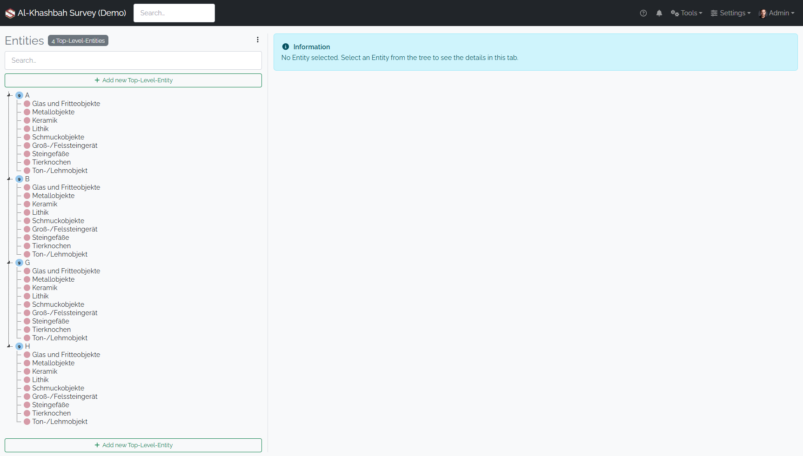
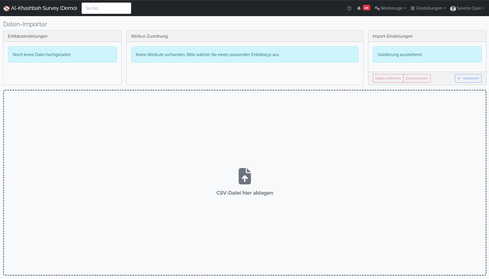
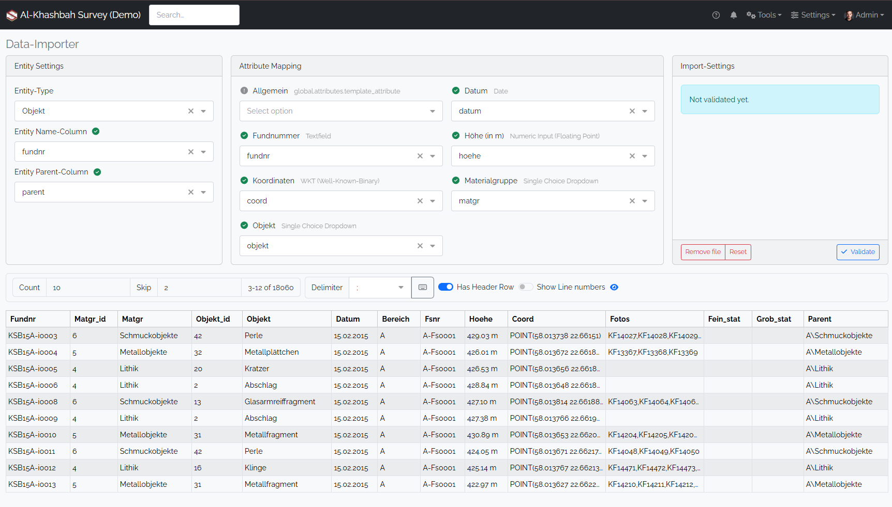
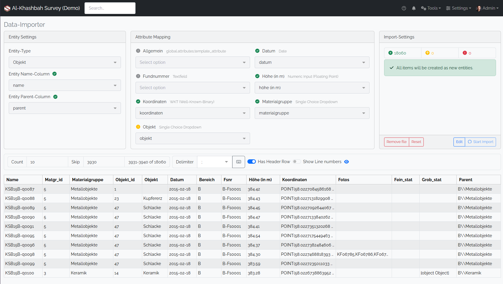

# Data Importer

The data importer is used to import already existing data to the spacialist software using CSV files.   
As there are many different non-trivial [Attribute Types](./attribute-types) supported, which require the data to be formatted properly
Visit the [Attribute Types](./attribute-types) page to get an overview of all attribute types and their respective import format. 

If you want to have an example of the file structure, you may [Export](./entity.md#export-entity-tree) a an example entity to get a scaffold for the import.

When you want to place the elements into a specific location in the [Entity Tree](./entity.md#entity-tree), then you need to specify a parent path column, that defines the absolute path to the created (or updated) entity. This path is composed from the entity names, separated by double backslashed (`\\\\`).

In this example we have A, B, G and H as top-level entities and they each contain a set of categories.
Now we want to add our `Object` entities at the correct location. So we go to the Data Importer at `Tools/Data Importer`.

When you land on the site, it is quite empty. You need to upload your csv file to the application, by either clicking on the upload area or just dragging it into the area.   

  

When the file is dropped, the file will be previewed at the bottom and the `Entity Settings` at the top become available. Now you need to make sure, that the table at the bototm is rendered correctly. It may happen that the column delimiter is not selected correctly and all text is rendered in one column. Select the appropriate delimiter in the toolbar and the preview table should update immediately.

When the table looks correct, you can proceed to select the target [Entity-Type](entity-type.md). Once it is selected, the `Attribute Mapping` becomes available and the app tries to automatically map all column to their respective attributes.  You are not required to upload all columns, empty columns in the mapping will be just ignored. Ensure the Mapping is correct, the green checkmark symbolizes that all rows contain some value (but it does not check if the entry is valid), if some values are missing it displays a yellow exclamation point and on hover it tells you how many rows are missing.

If the mapping's are done correctly, you can proceed to the validation step. In the `Import Settings` window press the validate button. Now the csv file will be actually uploaded to the server and will check if all fields meet the attribute's requirements, e.g. are all entries formatted correctly, are all thesaurus concepts available, etc. If not, every error will be listed in the `Import Settings` panel. Also a widget is shown, that will indicate how many records will be created, how many will be updated or how many errors occured.

If errors occur, you must go back and edit your csv file locally until it doesn't contain any errors. When the file is error-free, the widget tells you how many create and how many update operations will be made. This is a valuable information as it prevents you from creating or updating unintended entities.

When you are sure that you want to do the import, then click the `Start Import` button. As the validation and creation does contain expensive database operations, it may take some time until the validation and the actual upload are complete. If the file is too large, the application will report a timeout. As a workaround, you can upload the CSV file in smaller batches.