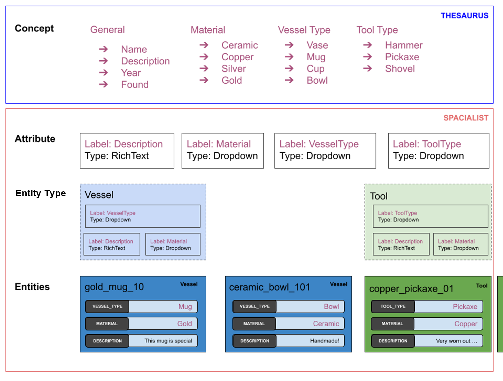

# Data Model

The program does not yet know, how your data is structured and gives you complete freedom on how to structure your data.
While also restricting the data to an appropriate data type. This structure is defined in the _Data Model_.

The *Data Model* contains all the _blueprints_ (in Spacialist: [Entity Types](./entity-type.md)) for the data you want to collect.
Your actual data is then collected using [Entitites](./entity.md), which is an object created from one of those _"blueprints"_. 
And each [Entity Type](./entity-type.md) is a composition of different [Attributes](./attribute.md), which are defined by an [Attrbiute Type](./attribute-types.md) 
and a label (as defined in the Thesaurex). Those attributes can then be used on multiple different entities and make it possible to 
have comparable data independent of _Entity Type_.

For Beginners, the concept is often a bit confusing and hard to understand, we'll illustrate the described relations using the following graphics:

## Designing an Entity Type

When creating an _Entity Type_ you should should sketch out, what values are connected to your _Entities_ and which 
[Attribute Types](./attribute-types.md) do reflect those values most appropriately, e.g. is it a text, an item from a set of values or a number. If it's a number, is a Unit connected to that value, is it an integer or is it an floating point value? **Take some time to think and design a good model, as it's hard to change it later in the process.** 

When you have a proper prototype of your Entity, the easiest way is to start is to go into the [ThesauRex](./thesaurus.md) and create all required attribute labels and items you want to have as a [Dropdown](#dropdown-lists)*.

If your entity used dropdowns, please check the _Dropdown Lists_ section first.

## Dropdown Lists

Dropdowns provide a way to select data from a predefined list of options which prevents errors and keeps the data consitent.
There are two different types of dropdowns single or multi dropdowns. When you wonder which one to use, then you must ask yourself, if there will be **always** a single item selected or is there in **any** case there will be a scenario when you need multiple values in this input:

| | |
| --- | --- |
| **Single** | The entity has a field "Medal", which will always be either "Gold", "Silver", "Bronze" or "None". |
| **Multiple** | The entity is a metal object which **can** have a mixture of materials, then you may want to add "Silver" and "Gold" on the same Entity. |

### ThesauRex- vs. Entity Dropdown

Spacialist provides two ways to create dropdown fields. 

| Type | When |Pro | Cons | 
|---|---|---|
| ThesauRex | More static and simple Data with a text label only. Managed inside ThesauRex. | |
| Entity | More dynamic and complex data with indefinite decree of complexity. Managed as _Entities_ directly inside Spacialist.  | |

