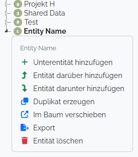

# Entity

An _Entity_ is a single data point in your research. To stick with the _Coin_ example, you can implement all different coins that you have found.

## Entity Tree

All entities are structured in a hierarchical way. This way you can keep all the entities organized and have can access the subtrees in a meaningful way.
This is especially useful, if your project is using the [Working Group](user-and-role-management.md#working-groups)

### Context Menu
When right-clicking an _Entity_ node in the contextmenu the user has a variety of additional options:

#### Export Entity Tree
_since version 0.11_

You may export the sub-tree of a selected entity into a collection of CSV files (one file per [_Entity Type_]('./entity-type')). This can be used to move Entities to another project or also provide a good example when preparing a dataset for the data import.

If only a single entity-type is exported, a CSV file will be downloaded. If multiple CSV files are generated, you'll receive a ZIP archieve with one CSV file for every _Entity Type_.

::: warning
The following _Entity Types_ are not included in an export: Group Separator, SQL & Serial
:::