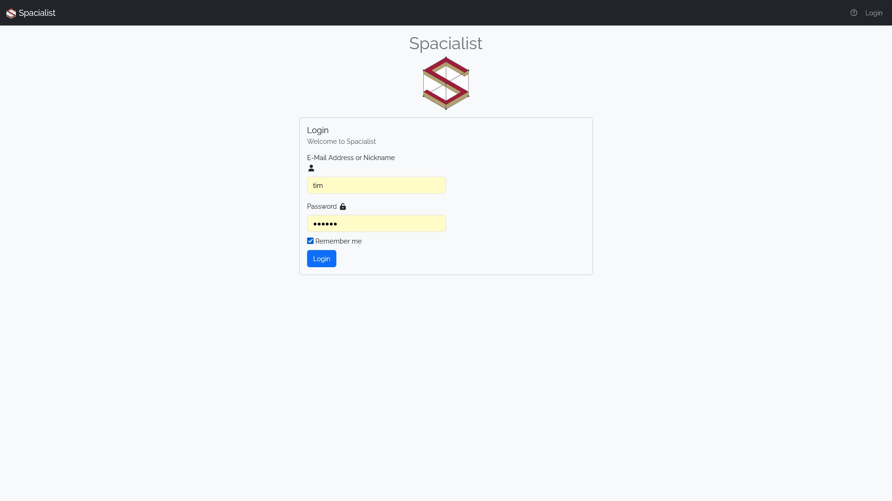
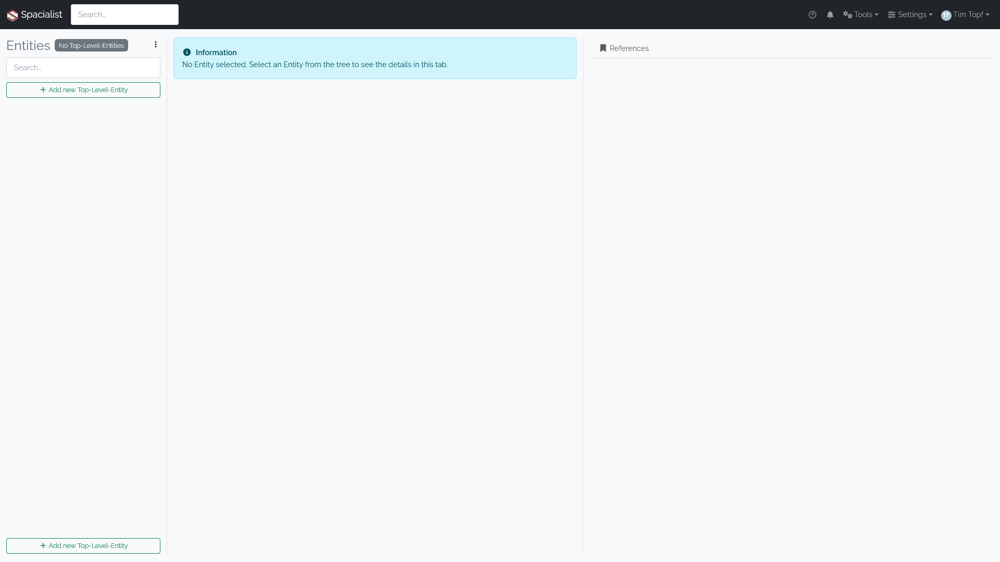

# Getting Started

When the Spacialist was setup and you can access the website and sign in using the credentials you received.

## Login

On your first visit you will be redirected to the login screen where you can login using your credentials.

## Spacialist Main View

After the first login, the application will appear empty, and even if you attempt to create new entities, it will not be possible in this initial mode.
That is to be expected, as Spacialist is a highly customizable software that needs to be properly setup, before you can start the data collection.

To get a better understanding, Spacialist consists of two main components: 

1. Spacialist: Create data types and manage data
2. ThesauRex: Create and manage vocabulary which is used inside Spacialist primarily for Labels and Dropdowns.

  