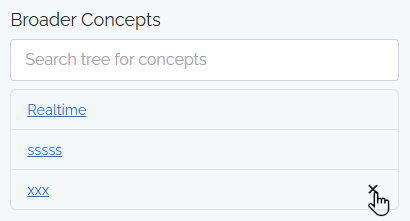
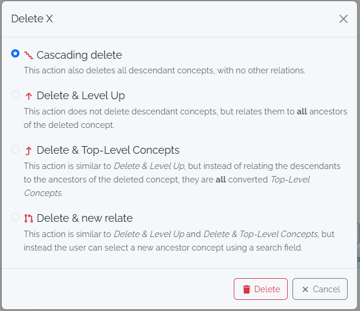

# Dictionary (Thesaurus)

Spacialist comes with a companion software - Thesaurex - which is responsible for managing a project-driven, centralized, standardized, multilingual, hierarchical vocabulary.

This vocabulary is used for [attribute labels](./attribute) and dropdown lists.

## Removing Relations

The easiest way to remove unwanted relations, is to remove the broader or narrower concepts inside the detail view. This option is only available, when the narrower or broader concept has other relations 
besides the current one. 

## Deleting Concepts

When you delete a concept, a dialog will open with a set of options on how to handle the delete.
Normally you want to cascade delete the entire tree, but this may be dangerous when you have child concepts. If those child concepets do have other relations, the deletion will only remove their relation
to the deleted parent node. But if there are no relations left, it'll be also **irreversibly** be deleted.

If you want to delete the current concept and keep the child concepts, you can use one of the other options to move the child concepts
to the _parent concept_ (level up), to the top level or a new parent by hand (new-relate).  

