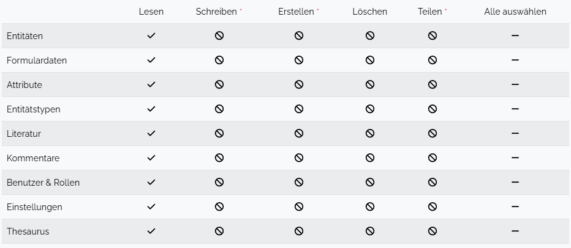

# User And Role Management

Spacialist supports a sophisticated user and role management system, that allows for a fine-grained access for users to prevent data-loss due to malicious activities.

## User

Every member of your team or additional external participants can be invited to access the project via an individual user account, as known from other online platforms. Those accounts can be managed via the interface "Settings > User Management". Here users can be created, settings can be adjusted and the password of individual users can be reset in case the password is forgotten.

## Creating a new User

After clicking the "Add New User" button on the _User Management_ page, a dialog let's you create a new User by providing the following properties:

| Name | Description |
| --- | ---|
| Name | Display name of the user |
| Nickname | Short alias for the user that can be used for login, and that can be referenced in comments via @_nickname_. |
| Email | The email of the user. Currently only used for login. |
| Password | A password for the user. User should change this password after the first login. |

After a new user is created, you must assign one or multiple roles to said user. [Roles](#roles) will be discussed further in the next chapter. When changing the roles of a user, you'll notice a yellow circle appearing at the end of the row, next to the three dots in the column 'Options'. Make sure to save the changes by klicking the three dots and click "Save". The yellow dot should disappear and the changes are saved.

::: tip
Users can upload an avatar for easier recognition, and better collaboration in the software.
:::

## Roles

Users by default do not have any user-permissions. Permissions are managed by roles, that bundle the permission into easy managable sets.
To add or adjust roles, visit the _Roles Management_ page at "Settings > Role Management".

### Creating a new Role

To create a new role, visit the _Role Management_ site. Here, you can create a new Role by clicking the "Add New Role" button at the top of the page. A role requires the following properties.

| Name | Description |
| --- | ---|
| Name | Display name of the role. Cannot be changed! |
| Displayname | The name that is visible inside the application. |
| Description | A short description of what the role is used for. This is primarily for the maintainers to better understand the reason behind a certain role.  |
| Preset | (Optional) Allows for using another role as 'preset' for having to make less adjustments to the newly created role.    |

After submitting the form, you can go to the next step to modify the permissions of the user.

### Modifying an existing Role

When you want to edit the permissions of an existing role, you visit the _Role Management_ page. Here you find the role you want to modify inside the roles list. With the icon in the 'Permissions' column, you can edit the current permissions of the selected role. The permissions will be displayed in the _Permission Matrix_ that looks similar to the image below. Just select the permissions inside the matrix to toggle said permission. You can toggle a whole row by clicking into the 'Select All' column. Those changes will be updated for all users who have that role assigned.

<figure>
    
    <figcaption>
    Example of a set permission matrix for a 'guest' user.
    </figcaption>
</figure>

When designing your roles keep in mind, that you can apply multiple roles to a user. You can also add and remove those roles at any time. As a general rule of thumb, the participants should have as little permissions as possible but enough to not be hindered in their work. To make this more clear. E.g. if you are working with some research assistants, you don't want them to make changes to the data model. They shall be only allowed to add and modify _Entities_. So you could create a role "Data Collector" that is only allowed to add and edit entities. 

## Working Groups

The _Working Groups_ are an extension on the premission system provided by the [_Role & Permission_](../user/permission) system. 
This allows the creation of groups, users can be assigned to. Access to certain [Entities](../entity.md) can be managed for the whole
groups using this feature.